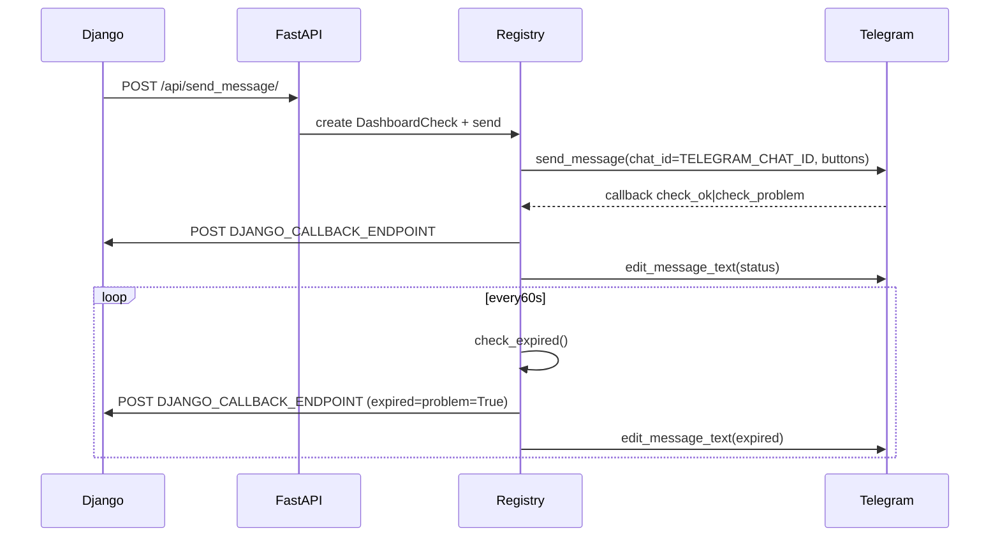

## Потоки и как это работает

### Общая схема

### Что где находится

- `main.py`: поднимает FastAPI и запускает aiogram polling в фоне (lifespan), а также периодическую задачу таймаутов.
- `src/services/checks_registry.py`: **бизнес-логика** сценария проверки:
  - отправка сообщения в Telegram, хранение активных проверок
  - обработка callback-кнопок
  - завершение по таймауту и обновление сообщения
- `src/api/checks.py`: HTTP входные точки от Django (`/api/send_message/`, `/api/link_clicked/{event_uuid}`) + новый более строгий endpoint (`/api/checks/send`).
- `src/services/django_client.py`: отправка результата проверки обратно в Django.

